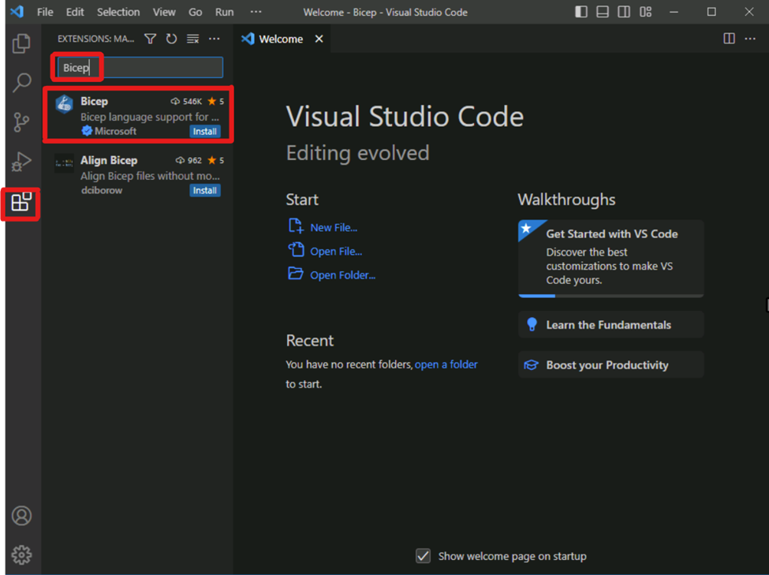

# Setup Your Bicep Dev Environment
Purpose: The purpose of guide is to setup the Bicep development environment.
Steps:
1. Download and install Visual Studio Code from https://code.visualstudio.com/download
2. Download and install Azure CLI from https://docs.microsoft.com/en-us/cli/azure/install-azure-cli
3. Create a new folder called “bicep” in your local machine.
Open Visual Studio Code and open the “bicep” folder.
4. Configure Auto Save in Visual Studio Code by going to File -> Auto Save
5. Install the Bicep extension in Visual Studio Code by going to Extensions -> Search for “Bicep” -> Install the one from Microsoft
    
    

6. Open the terminal in Visual Studio Code and type ```bicep --version```
   1. If you see the version of Bicep, then you have successfully installed the Bicep development environment.
   2. If you dont see the version of Bicep, then you need to install Bicep manualy by running [this script](../Scripts/InstallBicep.ps1) and then run the command ```bicep --version``` again.