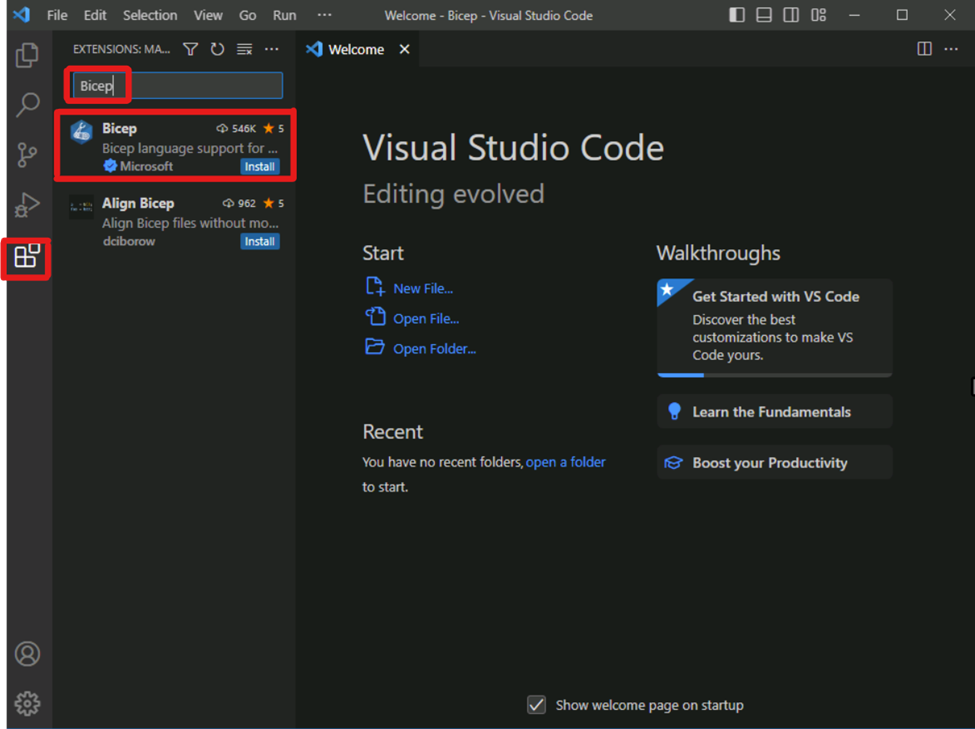

# Lab1 – Bicep Dev Environment
Purpose: The purpose of this lab is to setup the Bicep development environment.
Steps:
1. Download and install Visual Studio Code from https://code.visualstudio.com/download
2. Download and install Azure CLI from https://docs.microsoft.com/en-us/cli/azure/install-azure-cli
3. Create a new folder called “bicep” in your local machine.
Open Visual Studio Code and open the “bicep” folder.
4. Configure Auto Save in Visual Studio Code by going to File -> Auto Save
5. Install the Bicep extension in Visual Studio Code by going to Extensions -> Search for “Bicep” -> Install the one from Microsoft
    
    

7. Create a new file called “main.bicep” in the “bicep” folder.
Open the terminal in Visual Studio Code and type ```bicep --version```
    a. If you see the version of Bicep, then you have successfully installed the Bicep development environment.
    b. If you dont see the version of Bicep, then you need to install Bicep manualy by running [this script](../../Scripts/InstallBicep.ps1)
8. Paste the following code in the “main.bicep” file and save it.
    ```bicep
    resource sa 'Microsoft.Storage/storageAccounts@2022-05-01' = {
    name: 'bicepws90816298'
    location: 'westeurope'
    sku: {
        name: 'Standard_LRS'
    }
    kind: 'StorageV2'
    }
    ```
9. Change the name of the storage account to a unique name and save the file.
10. Create a resource group (either manually or using the Azure CLI) and deploy the Bicep file to Azure by running the following command in the terminal:
    ```bash
    az deployment group create --resource-group <resource-group-name> --template-file main.bicep
    ```